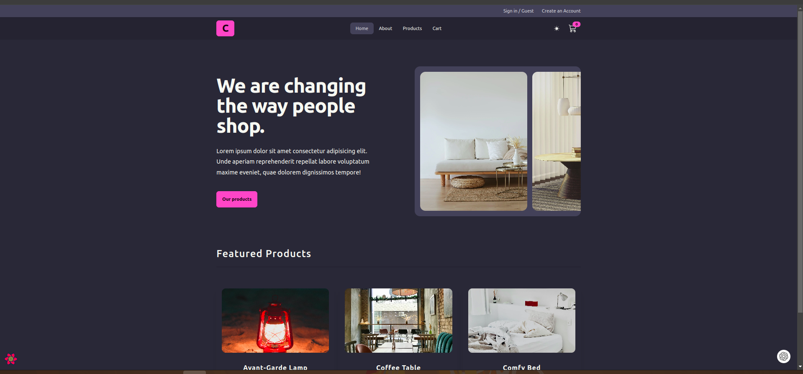
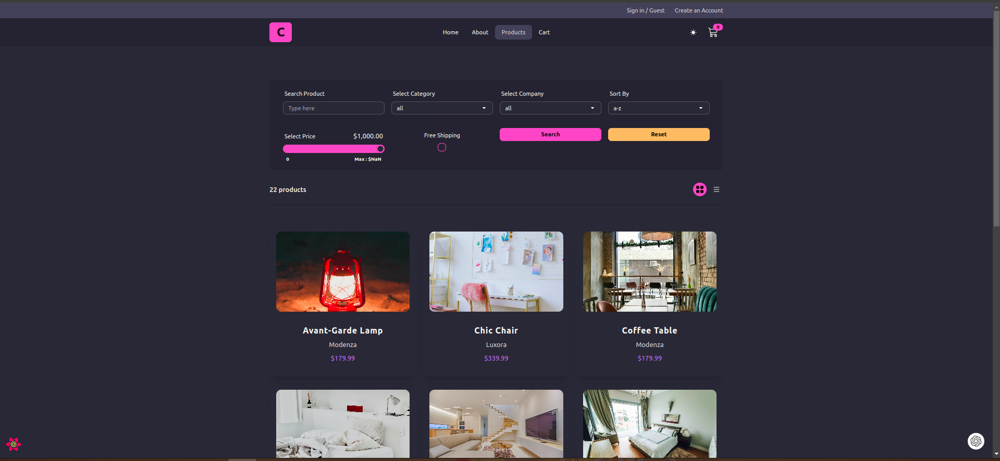

## Project Resources

- [API DOCS](https://documenter.getpostman.com/view/18152321/2s9Xy5KpTi)
- [Tailwind Docs](https://tailwindcss.com/docs/guides/vite)
- [DaisyUI](https://daisyui.com/)

## Tehnologies used

- Redux toolkit
- React Query
- React Icons
- Axios
- React Router
- Toastify
- Tailwind
- Daisy UI

## Project

Project is used from tutorial: [React tutorial and projects course](https://www.udemy.com/course/react-tutorial-and-projects-course/) from John Smilga

### Users should be able to

- Login and register or login as guest user
- Search for products and filter them
- Set products in cart
- Get all products from a cart
- See all orders
- Checkout order

## Run The App Locally

```sh
npm run install && npm run dev
```

## Live demo

Link: [https://resplendent-raindrop-776278.netlify.app/](https://resplendent-raindrop-776278.netlify.app/)

## Screenshots

### Home page

## 

### Products page

## 
